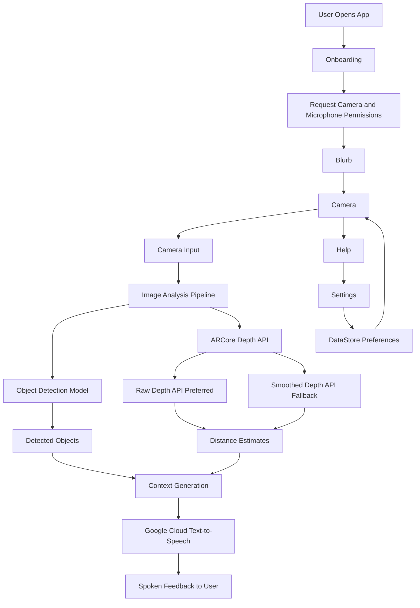

# Lumenate
**Summary**
Lumenate is an assisted sight application that allows users to navigate around a closed environment. Once the app has been set up and the user is ready to begin, it will alert them of nearby objects and even give emergency alerts for objects within 0.2 meters or less. Every screen and function of Lumenate is fully accessible with voice commands, making it perfect for any degree of visual disabilities.

# Architecture
The app follows a modular, easy-to-understand architecture built around Jetpack Compose and Android’s navigation system. A NavController manages which screen is displayed at runtime, routing users between five main composable screens: Onboarding, Blurb, Camera, Settings, and Help.

Onboarding introduces the app and requests the camera and microphone permissions needed for the core experience. Blurb gives users a fuller explanation of how the app works and how to interact with it. Settings allows users to customize their experience, while Help provides additional guidance and support.

The Camera screen contains the app’s main functionality. This is where Lumenate connects the device camera to the app’s computer vision pipeline, using Android’s built-in camera/image processing libraries, Google services such as Cloud Text-to-Speech, and a third-party machine learning model for object detection. Detected objects and environmental context are then converted into spoken feedback, allowing blind or visually impaired users to better understand their surroundings in real time.

User preferences are stored locally using DataStore Preferences, which saves simple key-value pairs such as accessibility or app configuration settings. Overall, the architecture separates navigation, UI, permissions, machine learning, audio feedback, and persistent settings into clear components, making the app easier to maintain, test, and extend.

# Feature Completeness including APIs and Sensors
The object detections features for this application are implemented using the TensorFlow Lite (TFLite) library, alongside EfficientDet, an ML model trained on the CoCo dataset capable of classifying around 90 objects. The depth calculations were implemented using Google’s ARCore Depth API, which creates a depth map, with a depth value and confidence value for each pixel’s depth from the user. For each object detected, we took the labeled pixels of that object, based on the coordinates of its bounding box, and then the median depth from all pixels within that object to get a distance measurement of how far the object is from the user. When the closest object is less than a certain distance away (around 0.2 meters), a proximity warning is issued, and the phone uses its vibration motor to vibrate the phone for 1 second, and Google’s TTS speaks to the user that the object is less than that certain distance away. The camera itself is also using ARCore’s Camera API, instead of CameraX, which was not compatible with ARCore. Lastly, the object’s relative bearings were calculated by measuring where the bounding box of the object was located in reference to the center of the image. Through using a phone’s built-in camera, alongside the device’s inertial measurement unit (accelerometer, gyroscope, and magnetometer), we can detect objects and measure their distance in a 3D space. Through using the device’s speakers and vibration motor, we can communicate object distances and warnings to the user. Lastly, through using the device’s microphone, the user has an accessible way to interact with the application. We also added a Settings Menu so that users can adjust how many objects they can detect and how fast they want it to be detected.

Text-to-speech was handled by Google’s Cloud Text-to-Speech API and makes use of 3 of their voices. The user is able to choose among any of these 3 voices for all necessary communication. Additionally, Android’s built in SpeechRecognizer with continuousSpeechFlow was used for speech-to-text capabilities and allows the user to navigate any screen with just their voice while ensuring a seamless flow of experience. We had previously used Android’s TTS engine for text-to-speech, but after switching to an API we had to implement a MediaPlayer to handle the playing of Google’s transmitted mp3s.

# Team Responsibilities & Contributions
Ilay implemented object detection using TFLite, originally with cameraX, which was corrected by Jimmy to make use of ARCore. He also manually processed the image so that the image can be easily fed into the model for detection. Next, after the first iteration of the Depth API integration, Ilay improved the system by prioritizing ARCore’s Raw Depth API when available, while falling back to the smoothed Depth API on devices that do not support raw depth. This improved the reliability of Lumenate’s distance estimates because Raw Depth provides less-processed depth values and includes confidence data for each pixel. Unlike the smoothed Depth API, which interpolates values to produce a complete depth map, Raw Depth preserves more accurate geometric information for valid pixels. This made it better suited for our app’s goal of estimating the distance to detected objects and communicating that information to blind or visually impaired users. Lastly, Ilay added the helper methods to allow the app to calculate relative bearings for objects based on the position of their bounding box in relation to the center of the image.

Jimmy mainly worked on Google’s ARCore functionality: Replacing the camera from cameraX to ARCore’s camera, adjusting the detection model to work with ARCore, and implementing the Depth/Raw Depth API to the app. He also adjusted the bounding box so that the Depth API can figure out what to measure for the distance of the object. Lastly, Jimmy implemented the Settings Screen to adjust the number of detected objects, and how often they should be detected, and added that state to the User Preferences Repository. He also implemented proximity detection/warnings so that when a user is less than 0.2m away from the closest object, a popup will show, and the phone vibrates, telling the user that they are too close to the object that is x meters away.
  
Nicholas worked on code architecture, including navigation and lifecycle maintenance, and implemented both the text-to-speech and speech-to-text services including screens to allow any potential somewhat visually capable user to have text artifacts as well. Before the app’s main functionality came into place, he provided detailed scaffolding and skeleton code for others to include their function callbacks once implemented. Once the rest of the app came into place (image detection and analysis), he ensured that the lifecycles of each composable and all coroutines could work in unison with no breaks. He was also the GitHub repository owner and worked through all merge conflicts and consolidation of branches into one final product.

# AI Disclosure
AI was used to help understand external libraries and APIs without the time cost needed for otherwise reading documentation extensively. Our methods for implementing Google’s ARCore Depth API, and TFLite library were greatly expedited by asking AI how we can incorporate these libraries given our application’s goals; i.e. "which functions in these libraries will help us accomplish our goals," "what inputs are necessary from our application to these functions," "describe the data type this function's outputs," etc.

# API Key Disclaimer
Anyone who would like to download the code, and properly run this app on Android Studio needs to make and attach their own API key for Google TTS in a file called local.properties under the Gradle Scripts folder.

